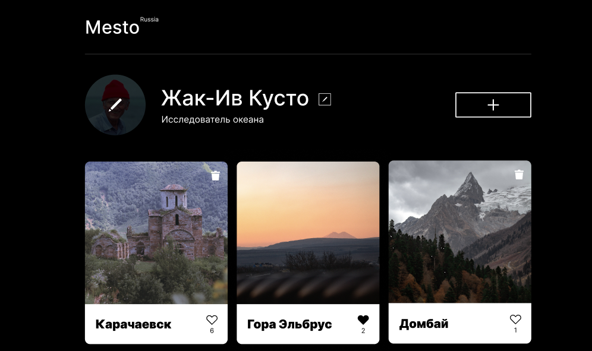
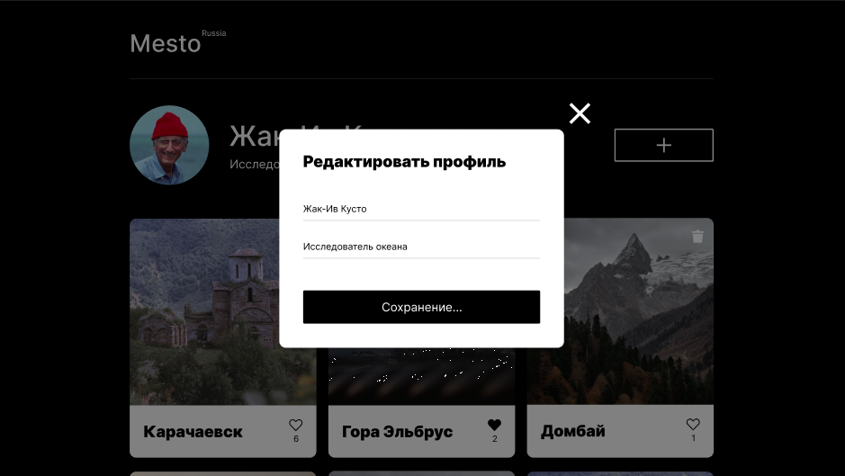
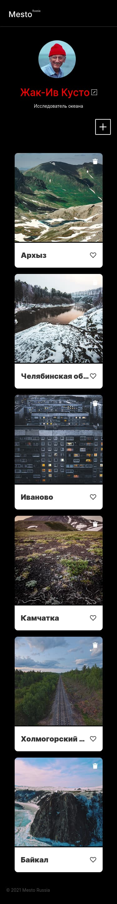

https://github.com/DaryaLanskaya/mesto-project-ff.git

# Проектная работа "Mesto" - Яндекс Практикум

## Описание проекта
Страница для создания и редактирования карточек.   
Реализована возможность добавления и удаления карточек, возможность лайка.  
На странице находятся несколько форм для взаимодействия с пользователями.  

## Live
[https://daryalanskaya.github.io/mesto-project-ff/](https://daryalanskaya.github.io/mesto-project-ff/) 

### Автор
[https://github.com/DaryaLanskaya](https://github.com/DaryaLanskaya) 

### Запуск

```
git pull https://github.com/DaryaLanskaya/mesto-project-ff.git
cd mesto-project-ff
npm i
npm run dev
```

### Скриншоты

  
  
  
